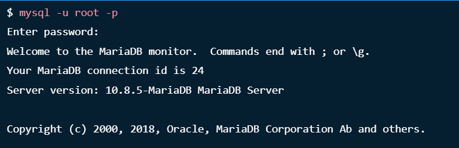
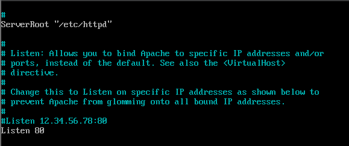
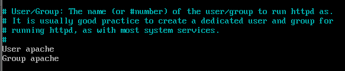
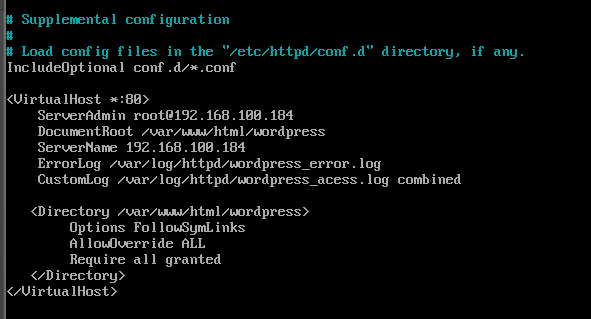
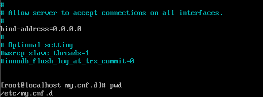

<p align="center">
  <a href="" rel="noopener">
 </a>
</p>

<h1 align="center">Conexão entre duas VMs, uma com MariaDB e outra com Wordpress, utilizando NFS para salvar os estáticos. </h1>
<p align="center"><i> Criando uma conexão entre duas VMs, onde a VM01 está utilizando o MariaDB e a VM02 está com o Wordpress e servidor apache. Além disso, os estáticos do wordpress serão salvos em uma pasta compartilhada (NFS).</i></p>

## Desafios anteriores:
- [Desafio 1](https://github.com/CleitonOS/compass-linux-desafio1)
- [Desafio 2](https://github.com/CleitonOS/compass-linux-desafio2)

## 📝 Tabela de conteúdos
- [Instalando tudo que é necessário (Passo 1)](#step1)
- [Configurando o Wordpress na VM02 (Passo 2)](#step2)
- [Configurações de segurança e permissões (Passo 3)](#step3)


## 🖥️ Instalando tudo que é necessário (Passo 1)<a name = "step1"></a>

### Atualizando o sistema
- Execute o seguinte comando:
    ```
    sudo dnf update
    ```
    
- Se houver atualizações do kernel, considere reiniciar a máquina com:

    ```
    sudo reboot
    ```

### Instalando MariaDB na VM01

1. Adicinando o repositório do MariaDB ao Oracle Linux

    ```
    curl -LsS https://downloads.mariadb.com/MariaDB/mariadb_repo_setup | sudo bash -s -- --mariadb-server-version="mariadb-10.6"
    ```

2. Instalando os pacotes do maria DB

    ```
    sudo dnf module reset mariadb -y
    sudo dnf -y install MariaDB-server MariaDB-client MariaDB-backup
    ```

- Inicie e habilide o serviço MariaDB:

    ```
    sudo systemctl enable --now mariadb
    ```

- Confira o status do serviço (Veja se o serviço está ativo):

    ```
    systemctl status mariadb
    ```

3. Faça a instalação segura do banco de dados MariaDB

- Execute o script de proteção do banco de dados para remover o banco de dados de teste e definir a senha root]

    ```
    mariadb-secure-installation
    ```

- Depois faça login como root para verificar se a senha definida está funcionando:

    ```
    mysql -u root -p
    ```

    
</br>

- Insira os seguintes comandos no MariaDB:

    ```
    CREATE DATABASE wordpress;
    CREATE USER 'wordpressuser'@'IP_VM02' IDENTIFIED BY 'sua_senha';
    GRANT ALL PRIVILEGES ON wordpress.* TO 'wordpressuser'@'IP_VM02';
    FLUSH PRIVILEGES;
    EXIT;
    ```
    - Observação: Não esqueça de substituir 'IP_VM02' pelo IP da sua segunda máquina que está com o Wordpress instalado, além disso dê um nome ao seu usuário (USER) e crie sua senha (sua_senha).


### Instalando Wordpress, Apache e PHP na VM02

1. Começando pelo **Apache**, instalando Apache HTTP Server
    
    ```
    sudo yum install httpd
    ```

- Inicie o serviço e configure-o para iniciar na inicialização

    ```
    sudo systemctl start httpd
    sudo systemctl enable httpd
    ```
<br/>

2. Instalando **PHP** e os módulos necessários

    ```
    dnf install php-fpm php-cli php-json php-gd php-mbstring php-pdo php-xml php-mysqlnd php-pecl-zip curl -y
    ```
    
- Inicie o PHP-FPM

    ```
    sudo systemctl start php-fpm
    sudo systemctl enable php-fpm
    ```
<br/>


3. Baixando e descompactando o **Wordpress**

- Mova para a pasta de instalação

    ```
    cd /var/www/html
    ```

- Baixe o Wordpress

    ```
    curl https://wordpress.org/latest.tar.gz --output wordpress.tar.gz
    ```

- Descompacte o arquivo

    ```
    tar xf wordpress.tar.gz
    ```

- Vá para a pasta do Wordpress

    ```
    cd /var/www/html/wordpress
    ```

- Crie um arquivo de configuração para o Wordpress

    ```
    sudo cp wp-config-sample.php wp-config.php
    sudo nano wp-config.php
    ```

- Lembra das informações que você preencheu ao criar um Database no MariaDB? Então, iremos utilizá-las agora:
    ```
    define('DB_NAME', 'wordpress');
    define('DB_USER', 'wordpressuser');
    define('DB_PASSWORD', 'sua_senha');
    define('DB_HOST', 'IP_VM01');
    ```
    - Não esqueça de colocar as informações que você definiu, as informações acima servem apenas como exemplo.

## Configurando o Wordpress na VM02 (Passo 2)<a name = "step2"></a>
Os últimos passos envolvendo o Wordpress já fazem parte da nossa configuração inicial, agora vamos aprofundar nessa questão.

1. Configurando a pasta de uploads do Wordpress

- Acesse novamente o arquivo wp-config.php em /var/www/html/wordpress/wp-config.php

    ```
    sudo nano wp-config.php
    ```

- Nas últimas linhas, antes de "require_once ABSPATH . 'wp-settings.php'" adicione esse comando:

    ```
    define('UPLOADS', 'wp-content/uploads');
    ```

    - Observação: "wp-content/uploads" é a pasta que defini como armazenamento dos uploads (normalmente é o padrão do wordpress), você pode configurar da sua forma.

2. Configurando o arquivo de configuração do Apache para o site
Em sistemas baseados em Red Hat, o arquivo de configuração padrão do Apache é geralmente chamado de 'httpd.conf' ou 'wordpress.conf', o caminho do arquivo pode variar dependendo de como você fez todo o processo e do seu sistema.

- Caminho do arquivo:

    ```
    sudo nano /etc/httpd/conf/httpd.conf
    ```

- Dentro do arquivo:
    </br>
    - Mude ou descomente as duas últimas linhas para ouvir uma porta ou IP específico. Nesse caso, vamos deixar a porta 80 descomentada.
    
    

    </br>

    - Lembre-se desse usuário pode ser útil para conceder permissões de acesso para o servidor mais tarde.

    

    </br>

    - Insira as linhas a partir de <VirtualHost *:80> para definir o diretório raiz e as configurações do Apache para o WordPress:

    

    Observação: Troque ServerAdmin por root@IP_VM02 (VM do Wordpress), ServerName troque também pelo seu "IP_VM02".

    - Salve e feche o arquivo de configuração. Reinicie o Apache para aplicar as alterações:

    ```
    sudo systemctl restart httpd
    ```

## Configurações de segurança e permissões (Passo 3)<a name = "step3"></a>

1. Verifique as permissões no MariaDB (VM01)

- Verificando se o usuário do Wordpress tem as permissões necessárias:

    ```
    SHOW GRANTS FOR 'wordpressuser'@'IP_VM02';
    ```

- Concedendo permissões se necessário:
    ```
    GRANT ALL PRIVILEGES ON *.* TO 'wordpressuser'@'IP_VM02' IDENTIFIED BY 'sua_senha' WITH GRANT OPTION;
    ```

- Tente se conectar a partir da VM02 para acessar o MariaDB na VM01:

    ```
    mysql -h IP_VM01 -u wordpressuser -p
    ```

- Caso ocorra algum erro, certifique de que as configurações de segurança do MariaDB não estejam bloqueando o acesso remoto.
    - A pasta de configuração é "/etc/my.cnf.d"; no meu caso o arquivo que continha "bind-address" era "server.cnf"
    - Descomente "bind-address=0.0.0.0"
    - Feito isso tente a conexão novamente.

    

2. Verifique o firewall na VM01
- Certifique-se de que o firewall na VM01 não esteja bloqueando a porta 3306, que é a porta padrão para conexões MySQL/MariaDB.

    ```
    firewall-cmd --list-all
    ```

- Caso a porta não esteja aberta, utilize os seguintes comandos:

    ```
    firewall-cmd --permanent --zone=public --add-port=3306/tcp
    firewall-cmd --reload
    ```

3. Verifique as políticas do SELinux que podem bloquear conexão de serviços httpd aos bancos de dados.

    Esse software de segurança pode causar alguns problemas do tipo "mysqli_real_connct() in /wp-includes/class-wpdb.php". Nesse caso, vamos resolver essa questão:

- Vendo as políticas que afetam os servidores web:
    ```
    getsebool -a | grep -E “^httpd_(unified|can_network_connect)?(_db)?\s”
    httpd_can_network_connect –> off
    httpd_can_network_connect_db –> off
    httpd_unified –> off
    ```

- As políticas que permitem esse tipo de conexão estão todas desligadas (off). Vamos mudar isso:

    - Permitir essas políticas específicas (sinalizador -P para persistir a reinicializações)

    ```
    sudo setsebool -P httpd_can_network_connect 1
    sudo setsebool -P httpd_can_network_connect_db 1
    sudo setsebool -P httpd_unified 1
    ```

- Valide se a alteração está em vigor

    ```
    getsebool -a | grep -E “^httpd_(unified|can_network_connect)?(_db)?\s”
    httpd_can_network_connect –> on
    httpd_can_network_connect_db –> on
    httpd_unified –> on
    ```

- Observação: Pode haver maneiras melhores de configurar as políticas, mas essas mudanças foram suficiente para eu continuar com a configuração do Wordpress.